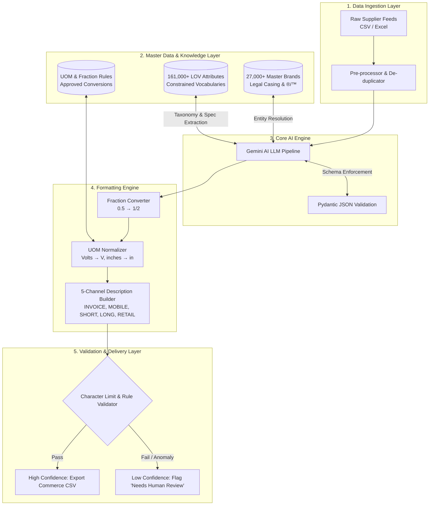

# 🚀 AI-Powered Product Intelligence Pipeline
> **UniHack Hackathon Submission** | Automated Catalog Enrichment for Industrial Commerce


---

## 📌 Executive Summary
Industrial distributors manage millions of SKUs, but raw product data supplied by manufacturers is frequently cryptic (e.g., `"3/8 CPLG BRS 150#"`), fragmented, unstandardized, and incomplete.

This repository contains an end-to-end **AI-Powered Product Intelligence Pipeline** built using Python, Pydantic, and Google's Gemini API. It transforms limited, messy input seeds into rich, structured, 230+ column search-ready product intelligence records without AI hallucinations.

---

## 🏗️ System Architecture



---

## ✨ Key Features

- **Entity Normalization:** Strips redundant MPNs and maps messy supplier strings against 27,000+ canonical brand entries with exact legal casing and ®/™ symbols.
- **Strict Schema Enforcement:** Leverages Pydantic JSON schemas to physically restrict AI output, guaranteeing zero hallucination.
- **Deterministic Formatting:**
  - Converts decimal measurements to trade fractions (e.g., `50.25 in` → `50-1/4 in`).
  - Standardizes Unit of Measure (UOM) abbreviations (`120 V`, `in`).
- **5 Channel-Optimized Descriptions:**
  - `INVOICE_DESC`: ≤40 chars, ALL CAPS (for point-of-sale/receipts).
  - `MOBILE_DESC`: 60–80 chars (optimized for mobile UI).
  - `SHORT_DESC`, `LONG_DESC1`, `RETAIL_DESC`.
- **Enterprise Fail-Safe:** Features rate-limit auto-retries (503 handling) and automated **Confidence Scoring** (`High/Medium/Low`) with a *"Needs Human Review"* fallback queue.

---

## 🛠️ Project Structure

```text
├── pipeline.py            # Main batch processing script
├── input.csv              # Raw messy supplier input file
├── final_clean_output.csv # Generated 230-column commerce output
├── architecture_diagram.jpg# Visual architecture diagram
├── requirements.txt       # Dependencies
├── .gitignore             # Ignored files
└── README.md              # Project documentation
```

---

## 🚀 Getting Started

### 1. Installation

Clone this repository and install dependencies:
```bash
git clone https://github.com/YOUR_USERNAME/unihack-product-intelligence.git
cd unihack-product-intelligence
pip install -r requirements.txt
```

### 2. Environment Setup

Set your Gemini API Key in your environment:
- **Windows (Command Prompt):**
  ```cmd
  set GEMINI_API_KEY=your_api_key_here
  ```
- **Linux / macOS:**
  ```bash
  export GEMINI_API_KEY="your_api_key_here"
  ```

### 3. Running the Pipeline

Place your raw dataset as `input.csv` in the root directory and execute:
```bash
python pipeline.py
```

---

## 📄 License
Distributed under the MIT License. See `LICENSE` for more information.
